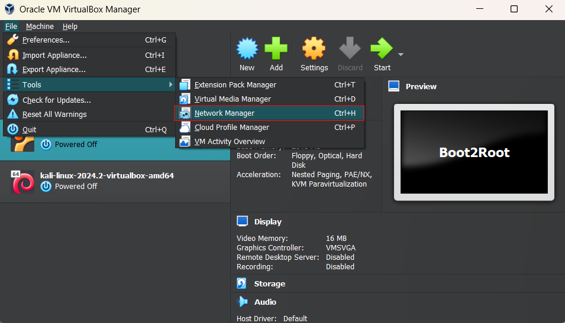
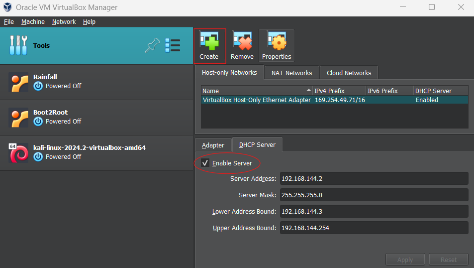
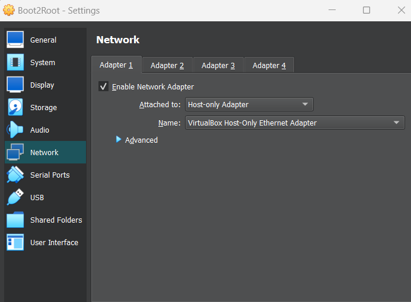

# Boot2Root

A CTF challenge where you need to find different ways to become root.

## Setup

<ins>Tools:</ins>
- [VirtualBox](https://www.virtualbox.org/wiki/Downloads)
- [Kali Linux](https://www.kali.org/get-kali/#kali-platforms)

To start, we need to download the tools listed above for this project.\
Once everything is downloaded, we can proceed to set up each virtual machine individually.

#### VirtualBox Setup
We need to create 2 separate virtual machines:
- One that hosts the server we have to attack
- A second one that will run under Kali Linux

After creating both VMs, we have to setup a virtual network so they can communicate together. To proceed, go into **File > Tools > Network Manager**.

Next, create a network if there's none present and enable the DHCP server.

And now, we have our virtual network set up!

To finish the setup, we need to connect our VMs to the newly created virtual network. For each machines, go into **Settings > Network**. Then, set `attached to:` on Host-only Adapter and select the virtual network we just created.

And *Voilà!* The virtual network is ready!