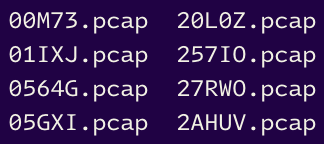
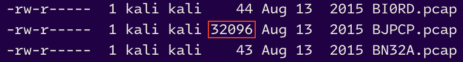

# EXPLOIT 6 : RECONSTRUCTING A SCRIPT

After transferring all the files from FTP into the *lmezard* user session, there's an alternative method to solve the *fun* challenge: this approach exploits the content of the zip file after extracting its contents.

## Exploring the archive

First, as noted in [writeup1](https://github.com/Daduli/Boot2Root/blob/master/writeup1.md), we know that the *fun* file is an archive. Thus, we can extract its contents using the following command:

```sh
tar -xvf fun
```

After extracting the archive, we get a folder named `ft_fun`. Upon inspecting its contents, we find that it contains **750 files**.

The files are named with five random characters consisting of letters (A-Z) and numbers (0-9), and each has a `.pcap` extension.



It's important to note that the `.pcap` extension indicates a file that contains a network packet capture, which can be analyzed using [Wireshark](https://www.wireshark.org/). Upon examining the contents of a file, we notice that the output differs somewhat from what we encountered earlier in [writeup1](https://github.com/Daduli/Boot2Root/blob/master/writeup1.md).

```c
}void useless() {

//file731
```

Since we know that the content of the files are not network packet captures from previously, we can conclude that the *.pcap* extension is just a bait, as confirmed by the `file` command. We also know that it contains C code instead.
```sh
Z85NC.pcap: ASCII text
```

While reviewing the files, we notice that one file stands out as being much larger than the others.



This file includes a *main()* function similar to the one we encountered in the previous exploit. Moreover, the comment containing a file number varies for each file, leading us to conclude that the content of a single file is distributed across 750 different files.

## Bash-ing for *fun*

We'll reconstitue the *main()* function in 2 steps.

1. **Sorting the files**

In a shell script, we can sort the file names in the correct order using the `sort` command and then redirect the output in a new file. Just like that:

```bash
(for f in *; do echo "$(tail -1 $f | cut -c7-9) $f"; done) | sort -n > ../sort.txt
```

- `for f in *` : loop for each file in the current directory
- `do echo "$(tail -1 $f | cut -c7-9) $f"`
	- `tail -1` : display the last line of the file
	- `|` : send the output of the `tail` command to the `cut` command
	- `cut -c7-9` : extract the number of the file, the number is always at the 7th, 8th and 9th character
	- `$f` : the name of the file
- `done` : end of the loop
- `sort -n` : sort the output <u>numerically</u> (`-n`)
- `> ../sort.txt` : redirect the output in the file `sort.txt` in the parent directory

> Note: The loop produces an output that includes both the number and the name of the associated file.

Looking into *sort.txt*, we can see that the files are now sorted.

```
1 YJR5Z.pcap
2 20L0Z.pcap
3 ZP1ZN.pcap
4 BNFBP.pcap
5 331ZU.pcap
6 APM1E.pcap
7 FXG1L.pcap
8 MSHCC.pcap
9 ZFVLR.pcap
...
750 BJPCP.pcap
```

---

2. **Merging into one file**

Next, we will reconstruct the *main()* function using the following command:

```bash
(for line in $(cat ../sort.txt); do cat $line 2> /dev/null; echo ; done) > main.c
```
- `for line in $(cat ../sort.txt)` : loop for each line in *sort.txt* 
- `do cat $line 2> /dev/null` : display the content of *sort.txt* and redirect into */dev/null*  if the file doesn't exist
- `echo` : add a newline between each file
- `done` : end of the loop
- `> main.c` : redirect the output into *main.c*

> Note: The purpose of using the "2>" operator is to filter out any lines with only a carriage return.

---

Finally, we can compile and execute the *main.c* file to obtain the password.

```
gcc main.c -o password && ./password
```

It gives the string `Iheartpwnage`.\
From here, we can proceed to the step before encrypting the password in [writeup1](https://github.com/Daduli/Boot2Root/blob/master/writeup1.md).
